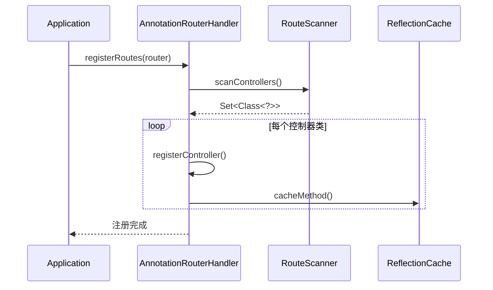
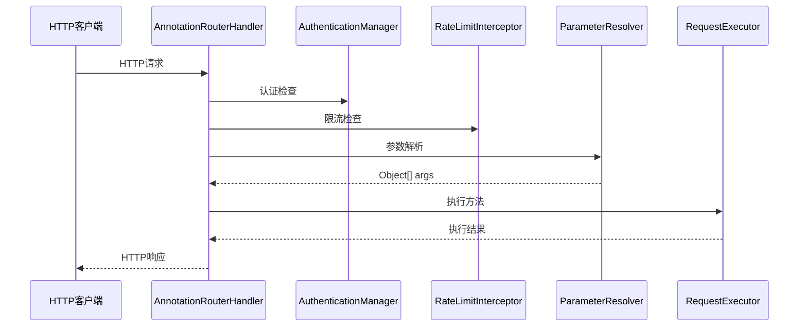

# 路由器架构设计文档

## 📋 概述

本文档描述了 Vert.x Template 项目中路由器模块的重构架构设计。基于单一职责原则，我们将原本的单体路由处理器拆分为多个专职组件，提高了代码的可维护性、可测试性和可扩展性。

## 🏗️ 整体架构

### 架构图

```
HTTP请求
    ↓
AnnotationRouterHandler (协调器)
    ↓
┌─────────────── 路由注册阶段 ──────────────┐
│                                        │
│  RouteScanner → ParameterResolver      │
│      ↓               ↓                 │
│  控制器扫描     → 路由元数据生成          │
│                                        │
└────────────────────────────────────────┘
    ↓
┌─────────────── 请求处理阶段 ──────────────┐
│                                        │
│  认证检查 → 限流检查 → 参数解析 → 方法执行  │
│     ↓         ↓         ↓         ↓    │
│  AuthMgr   RateLimit  ParamRes   ReqExec │
│                                        │
└────────────────────────────────────────┘
    ↓
ResponseHandler (响应处理)
    ↓
HTTP响应
```

## 🔧 核心组件

### 1. AnnotationRouterHandler (协调器)
**📂 位置**: `src/main/java/com/vertx/template/router/handler/AnnotationRouterHandler.java`
**📏 代码行数**: ~290行

#### 职责范围
- **路由注册协调**: 统筹整个路由注册流程
- **请求分发**: 将HTTP请求分发给各专职组件处理
- **组件整合**: 协调各组件间的交互和数据流转
- **异常统一处理**: 捕获和处理组件间的异常

#### 核心方法
```java
// 路由注册入口
public void registerRoutes(Router router)

// 控制器注册
private void registerController(Router router, Class<?> controllerClass)

// 请求处理协调
private Object executeRouteHandler(RoutingContext ctx, Object controller, Method method)
```

#### 设计原则
- **门面模式**: 为外部提供统一的路由注册接口
- **职责简化**: 只负责协调，不处理具体业务逻辑
- **依赖注入**: 通过构造器注入所有依赖组件

---

### 2. RouteScanner (路由扫描器)
**📂 位置**: `src/main/java/com/vertx/template/router/scanner/RouteScanner.java`
**📏 代码行数**: ~65行

#### 职责范围
- **类扫描**: 扫描指定包下的控制器类
- **注解检测**: 检测`@RestController`注解
- **控制器发现**: 构建控制器类集合

#### 核心方法
```java
// 扫描控制器类
public Set<Class<?>> scanControllers()

// 验证控制器有效性
public boolean isValidController(Class<?> clazz)
```

#### 设计优势
- **单一职责**: 专注于类扫描和发现
- **配置化**: 基于RouterConfig进行包路径配置
- **异常处理**: 统一的扫描异常处理机制

---

### 3. ParameterResolver (参数解析器)
**📂 位置**: `src/main/java/com/vertx/template/router/resolver/ParameterResolver.java`
**📏 代码行数**: ~318行

#### 职责范围
- **参数提取**: 从HTTP请求中提取各种类型参数
- **类型转换**: 将字符串参数转换为目标Java类型
- **参数验证**: 执行参数长度、必填性等验证

#### 支持的参数类型
| 注解类型       | 描述     | 示例            |
| -------------- | -------- | --------------- |
| `@PathParam`   | 路径参数 | `/users/{id}`   |
| `@QueryParam`  | 查询参数 | `?name=value`   |
| `@RequestBody` | 请求体   | JSON对象        |
| `@HeaderParam` | 请求头   | `Authorization` |
| `@CurrentUser` | 当前用户 | 用户上下文      |

#### 核心方法
```java
// 参数解析入口
public Object[] resolveArguments(MethodMetadata metadata, Method method, RoutingContext ctx)

// 类型转换
private Object convertValue(String value, Class<?> targetType, String parameterName)

// 参数验证
private void validateParameterLength(String value, String name, String paramType)
```

#### 特性
- **缓存支持**: 支持基于元数据缓存的快速解析
- **反射兼容**: 兼容无缓存的反射解析方式
- **详细错误**: 提供详细的参数错误信息

---

### 4. RequestExecutor (请求执行器)
**📂 位置**: `src/main/java/com/vertx/template/router/executor/RequestExecutor.java`
**📏 代码行数**: ~78行

#### 职责范围
- **方法调用**: 执行控制器方法
- **结果处理**: 处理方法返回值（包括Future类型）
- **异常转换**: 将各种异常标准化为业务异常

#### 核心方法
```java
// 方法执行入口
public Object execute(Object controller, Method method, Object[] args)

// 异常标准化
public Exception normalizeException(Exception exception)
```

#### 异常处理映射
```java
AuthenticationException → 直接返回
RateLimitException → 直接返回
ValidationException → 直接返回
BusinessException → 直接返回
其他Exception → 转换为BusinessException(500)
```

## 🔄 请求处理流程

### 1. 路由注册阶段


### 2. 请求处理阶段


## 📊 重构对比

### 重构前 vs 重构后

| 维度         | 重构前           | 重构后               |
| ------------ | ---------------- | -------------------- |
| **文件大小** | 813行            | 4个文件，平均180行   |
| **职责数量** | 7个主要职责      | 每个组件1个主要职责  |
| **可测试性** | 困难（大量Mock） | 容易（组件独立测试） |
| **可扩展性** | 修改困难         | 组件化扩展           |
| **代码重复** | 参数解析重复     | 统一的参数解析逻辑   |

### 符合规范检查

✅ **文件层级**: 不超过3级
✅ **代码量限制**: 每个文件≤800行
✅ **职责单一**: 每个组件职责明确
✅ **命名规范**: 大驼峰类名，小驼峰方法名
✅ **注释要求**: 完整的功能和参数描述

## 🎯 设计原则

### 1. 单一职责原则 (SRP)
每个组件只负责一个明确的职责：
- RouteScanner → 扫描
- ParameterResolver → 解析
- RequestExecutor → 执行
- AnnotationRouterHandler → 协调

### 2. 依赖注入原则 (DIP)
通过Guice注入管理组件依赖，降低耦合度

### 3. 开闭原则 (OCP)
新增参数类型或处理逻辑时，只需扩展对应组件

### 4. 接口隔离原则 (ISP)
各组件提供专门的方法接口，避免不必要的依赖

## 🚀 扩展指南

### 添加新的参数类型
1. 在`ParameterResolver`中添加新的注解处理
2. 更新`MethodMetadata.ParameterType`枚举
3. 实现对应的解析逻辑

### 添加新的中间件
1. 在`executeRouteHandler`中添加中间件调用
2. 注入对应的中间件组件
3. 按照认证→限流→自定义的顺序执行

### 性能优化
1. 继续利用`ReflectionCache`缓存反射信息
2. 考虑增加参数解析结果缓存
3. 使用异步处理提升并发性能

## 🧪 测试策略

### 单元测试
```java
// RouteScanner测试
@Test
void shouldScanControllers() {
    Set<Class<?>> controllers = routeScanner.scanControllers();
    assertThat(controllers).isNotEmpty();
}

// ParameterResolver测试
@Test
void shouldResolvePathParam() {
    Object[] args = parameterResolver.resolveArguments(metadata, method, ctx);
    assertThat(args[0]).isEqualTo(expectedValue);
}

// RequestExecutor测试
@Test
void shouldExecuteMethod() {
    Object result = requestExecutor.execute(controller, method, args);
    assertThat(result).isNotNull();
}
```

### 集成测试
```java
@Test
void shouldHandleCompleteRequest() {
    // 测试完整的请求处理流程
    given()
        .when().post("/api/users")
        .then().statusCode(201);
}
```

## 📈 监控指标

建议监控以下指标：
- **路由注册成功率**: 监控控制器注册失败情况
- **参数解析错误率**: 监控参数验证失败率
- **方法执行时间**: 监控控制器方法执行性能
- **异常分布**: 统计各类异常的发生频率

## 🔚 总结

通过这次重构，我们成功地：

1. **降低复杂度**: 将813行的大文件拆分为4个专职组件
2. **提高可维护性**: 每个组件职责明确，便于独立修改
3. **增强可测试性**: 组件化设计便于编写单元测试
4. **支持可扩展性**: 新功能可通过扩展对应组件实现
5. **符合编码规范**: 满足项目规范的所有要求

这个架构为后续的功能扩展和性能优化奠定了良好的基础。
