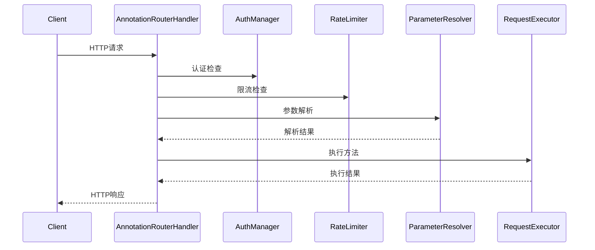

# 路由模块设计指南

本文档描述了Vert.x项目中路由模块的设计架构、重构优化和最佳实践。

> 📚 **相关文档**: 详细的架构设计请参考 [路由器架构设计文档](modules/router-architecture.md)

## 📋 目录

1. [模块架构](#模块架构)
2. [重构成果](#重构成果)
3. [常量提取优化](#常量提取优化)
4. [错误处理器优化](#错误处理器优化)
5. [设计原则](#设计原则)
6. [使用指南](#使用指南)

---

## 模块架构

### 重构后组件结构

```
router/
├── handler/
│   └── AnnotationRouterHandler.java     # 路由协调器（重构）
├── scanner/
│   └── RouteScanner.java               # 路由扫描器（新增）
├── resolver/
│   └── ParameterResolver.java          # 参数解析器（新增）
├── executor/
│   └── RequestExecutor.java            # 请求执行器（新增）
├── cache/
│   └── ReflectionCache.java            # 反射缓存
└── annotation/
    ├── RestController.java              # 控制器注解
    ├── RequestMapping.java              # 请求映射注解
    └── ...                             # 其他注解
```

### 职责分工

| 组件                        | 职责                           | 代码行数 | 设计模式 |
| --------------------------- | ------------------------------ | -------- | -------- |
| **AnnotationRouterHandler** | 路由注册协调，组件整合         | ~290行   | 门面模式 |
| **RouteScanner**            | 控制器扫描，注解检测           | ~65行    | 单一职责 |
| **ParameterResolver**       | 参数解析，类型转换，参数验证   | ~318行   | 策略模式 |
| **RequestExecutor**         | 方法执行，结果处理，异常标准化 | ~78行    | 命令模式 |

---

## 重构成果

### 📊 重构对比

| 维度         | 重构前           | 重构后               | 改进效果         |
| ------------ | ---------------- | -------------------- | ---------------- |
| **文件大小** | 813行单文件      | 4个文件，平均180行   | ✅ 符合≤800行规范 |
| **职责数量** | 7个主要职责      | 每个组件1个主要职责  | ✅ 单一职责原则   |
| **可测试性** | 困难（大量Mock） | 容易（组件独立测试） | ✅ 提升测试效率   |
| **可扩展性** | 修改困难         | 组件化扩展           | ✅ 支持功能扩展   |
| **代码重复** | 参数解析重复     | 统一解析逻辑         | ✅ DRY原则        |

### 🎯 架构优势

1. **职责明确**: 每个组件专注于特定功能
2. **易于维护**: 独立组件便于修改和调试
3. **高度可测试**: 组件化设计便于单元测试
4. **支持扩展**: 新功能可通过扩展组件实现
5. **性能优化**: 保持反射缓存，提升执行效率

### 🔄 请求处理流程



---

## 常量提取优化

### 优化前问题

- 常量分散在各个类中，难以维护
- 重复定义相同的HTTP状态码和响应头
- 硬编码字符串增加出错风险

### 优化后方案

#### 1. HttpConstants 常量类

```java
public final class HttpConstants {
    // HTTP状态码
    public static final int HTTP_OK = 200;
    public static final int HTTP_NOT_FOUND = 404;

    // 响应头
    public static final String CONTENT_TYPE_HEADER = "content-type";
    public static final String APPLICATION_JSON = "application/json";

    // 错误消息
    public static final String ERROR_NOT_FOUND = "Not Found";
    public static final String ERROR_METHOD_NOT_ALLOWED = "Method Not Allowed";
}
```

#### 2. RouterConstants 常量类

```java
public final class RouterConstants {
    // 包路径
    public static final String BASE_PACKAGE = "com.vertx.template";
    public static final String CONTROLLER_PACKAGE = BASE_PACKAGE + ".controller";

    // 日志消息
    public static final String LOG_ANNOTATION_ROUTES_REGISTERED = "基于注解的路由注册完成";
    public static final String LOG_EXCEPTION_HANDLERS_CONFIGURED = "全局异常处理器配置完成";
}
```

#### 3. 静态导入使用

```java
// 在RouterRegistry中使用静态导入
import static com.vertx.template.constants.HttpConstants.*;
import static com.vertx.template.constants.RouterConstants.*;

// 直接使用常量，无需类名前缀
ctx.response().setStatusCode(HTTP_OK)
    .putHeader(CONTENT_TYPE_HEADER, APPLICATION_JSON);
```

### 优化效果

✅ **统一管理**：所有HTTP相关常量集中管理
✅ **减少重复**：避免在多个类中重复定义相同常量
✅ **提高可读性**：使用有意义的常量名替代魔法数字
✅ **便于维护**：修改常量值只需在一处进行
✅ **类型安全**：编译时检查，避免运行时错误

---

## 错误处理器优化

### 优化前问题

```java
// 重复的错误处理器注册代码
registerErrorHandler(HTTP_NOT_FOUND, "Not Found");
registerErrorHandler(HTTP_METHOD_NOT_ALLOWED, "Method Not Allowed");
registerErrorHandler(HTTP_TOO_MANY_REQUESTS, "Too Many Requests");
// ... 更多重复代码
```

### 优化后方案

#### 1. 配置数组模式

```java
/** 错误处理器配置数组 */
private static final ErrorHandlerConfig[] ERROR_HANDLERS = {
    new ErrorHandlerConfig(HTTP_NOT_FOUND, ERROR_NOT_FOUND),
    new ErrorHandlerConfig(HTTP_METHOD_NOT_ALLOWED, ERROR_METHOD_NOT_ALLOWED),
    new ErrorHandlerConfig(HTTP_TOO_MANY_REQUESTS, ERROR_TOO_MANY_REQUESTS),
    new ErrorHandlerConfig(HTTP_SERVICE_UNAVAILABLE, ERROR_SERVICE_UNAVAILABLE),
    new ErrorHandlerConfig(HTTP_GATEWAY_TIMEOUT, ERROR_GATEWAY_TIMEOUT)
};
```

#### 2. 内部配置类

```java
/** 错误处理器配置内部类 */
private static class ErrorHandlerConfig {
    final int statusCode;
    final String message;

    ErrorHandlerConfig(int statusCode, String message) {
        this.statusCode = statusCode;
        this.message = message;
    }
}
```

#### 3. 循环注册

```java
/** 注册HTTP状态码错误处理器 */
private void registerHttpErrorHandlers() {
    // 使用配置数组简化错误处理器注册
    for (ErrorHandlerConfig config : ERROR_HANDLERS) {
        registerErrorHandler(config.statusCode, config.message);
    }
}
```

### 优化效果

✅ **减少重复代码**：从5行重复调用简化为1个循环
✅ **配置集中化**：所有错误处理器配置在一个数组中
✅ **易于扩展**：添加新的错误处理器只需在数组中增加一行
✅ **数据驱动**：通过配置数据驱动代码执行
✅ **提高可读性**：配置和逻辑分离，代码更清晰

---

## 设计原则

### 1. 单一职责原则 (SRP)

- **RouterRegistry**：专注于路由注册协调
- **HttpConstants**：专注于HTTP相关常量定义
- **RouterConstants**：专注于路由相关常量定义

### 2. 开闭原则 (OCP)

- 通过配置数组支持扩展新的错误处理器
- 通过常量类支持新增常量而不修改现有代码

### 3. 依赖倒置原则 (DIP)

- 依赖抽象的常量定义，而非具体的硬编码值
- 通过依赖注入获取处理器实例

### 4. 不重复原则 (DRY)

- 提取公共常量避免重复定义
- 使用配置数组避免重复的注册代码

---

## 使用指南

### 1. 添加新的HTTP状态码

```java
// 在 HttpConstants.java 中添加
public static final int HTTP_CONFLICT = 409;
public static final String ERROR_CONFLICT = "Conflict";

// 在 RouterRegistry.java 的 ERROR_HANDLERS 数组中添加
new ErrorHandlerConfig(HTTP_CONFLICT, ERROR_CONFLICT)
```

### 2. 添加新的路由常量

```java
// 在 RouterConstants.java 中添加
public static final String API_V2_PREFIX = "/api/v2";
public static final String LOG_V2_ROUTES_REGISTERED = "API v2路由注册完成";
```

### 3. 扩展错误处理逻辑

```java
// 可以在 ErrorHandlerConfig 中添加更多配置项
private static class ErrorHandlerConfig {
    final int statusCode;
    final String message;
    final boolean logError;  // 新增：是否记录错误日志

    ErrorHandlerConfig(int statusCode, String message, boolean logError) {
        this.statusCode = statusCode;
        this.message = message;
        this.logError = logError;
    }
}
```

### 4. 最佳实践

#### ✅ 推荐做法

```java
// 使用常量
ctx.response().setStatusCode(HTTP_OK);

// 使用静态导入
import static com.vertx.template.constants.HttpConstants.*;

// 配置驱动
for (ErrorHandlerConfig config : ERROR_HANDLERS) {
    registerErrorHandler(config.statusCode, config.message);
}
```

#### ❌ 避免做法

```java
// 硬编码数字
ctx.response().setStatusCode(200);

// 硬编码字符串
logger.info("基于注解的路由注册完成");

// 重复代码
registerErrorHandler(404, "Not Found");
registerErrorHandler(405, "Method Not Allowed");
```

---

## 总结

通过本次优化，RouterRegistry模块实现了：

1. **常量提取**：创建了HttpConstants和RouterConstants两个常量类，统一管理所有常量
2. **代码简化**：使用配置数组和循环注册简化了错误处理器注册逻辑
3. **可维护性提升**：代码结构更清晰，扩展更容易
4. **符合规范**：遵循阿里巴巴Java开发规范和设计原则

这些优化在不改变功能的前提下，显著提升了代码质量和可维护性，为后续开发奠定了良好基础。
